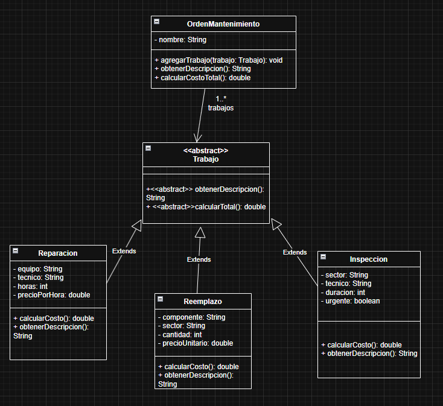

# Final -- Orientación a Objetos 1

## Gestión de órdenes de mantenimiento de edificios

> Resolución completa basada en el enunciado del final de julio de 2026,
> siguiendo el enfoque de diseño, implementación y pruebas que venimos
> trabajando.

------------------------------------------------------------------------

# 1. Análisis del enunciado

El sistema se ocupa de gestionar **órdenes de mantenimiento** de
edificios.

Una orden tiene:

-   un nombre;
-   varios trabajos de mantenimiento.

Los trabajos pueden ser de tres tipos:

1.  Inspección.
2.  Reparación.
3.  Reemplazo.

Cada tipo de trabajo tiene información y comportamiento propio.

## 1.1. Clases candidatas

A partir del enunciado aparecen los siguientes conceptos:

-   `OrdenMantenimiento`
-   `Trabajo`
-   `Inspeccion`
-   `Reparacion`
-   `Reemplazo`

También aparecen:

-   técnico;
-   sector;
-   equipo;
-   componente.

Sin embargo, el enunciado solamente necesita conocerlos como datos
simples (`String`). No tienen atributos ni comportamiento propio que
justifiquen convertirlos en clases.

Por ejemplo:

``` java
private String tecnico;
private String sector;
private String equipo;
private String componente;
```

Esto es una decisión importante de modelado: no todo sustantivo que
aparece en un enunciado necesariamente debe convertirse en una clase.

------------------------------------------------------------------------

# 2. Modelo de dominio

La relación principal es:

``` text
OrdenMantenimiento 1 -------- 0..* Trabajo
```

Una orden contiene cero o muchos trabajos.

`Trabajo` debe ser una clase abstracta porque los tres tipos de trabajo
comparten un protocolo, pero cada uno calcula su costo y construye su
descripción de una manera diferente.

La jerarquía es:

``` text
                  <<abstract>>
                     Trabajo
                        ▲
             ┌──────────┼──────────┐
             │          │          │
             │          │          │
       Inspeccion  Reparacion  Reemplazo
```

La idea fundamental es utilizar **polimorfismo**.

La orden no necesita preguntar:

``` java
if (trabajo es Inspeccion) ...
if (trabajo es Reparacion) ...
if (trabajo es Reemplazo) ...
```

Simplemente envía:

``` java
trabajo.calcularCosto();
```

o:

``` java
trabajo.obtenerDescripcion();
```

Cada objeto concreto ejecutará su propia implementación.

------------------------------------------------------------------------

# 3. UML propuesto



------------------------------------------------------------------------

# 4. Decisiones de diseño

## 4.1. ¿Por qué Trabajo es abstracta?

Porque los tres tipos de trabajo tienen comportamiento común a nivel de
protocolo:

``` java
calcularCosto()
obtenerDescripcion()
```

pero la implementación cambia.

### Inspección

Una inspección normal cuesta:

``` text
$6000
```

Una inspección urgente:

``` text
$9000
```

### Reparación

``` text
horas * precioPorHora
```

### Reemplazo

``` text
cantidad * precioUnitario
```

Por eso la clase abstracta permite definir:

``` java
public abstract double calcularCosto();

public abstract String obtenerDescripcion();
```

y dejar la implementación a las subclases.

------------------------------------------------------------------------

## 4.2. ¿Por qué no usar instanceof?

Una alternativa sería que `OrdenMantenimiento` analizara el tipo
concreto de cada trabajo:

``` java
if (trabajo instanceof Inspeccion) {
    ...
}
```

No es la solución que conviene utilizar acá.

El diseño buscado es polimórfico:

``` java
trabajo.calcularCosto();
```

La responsabilidad de saber cómo se calcula el costo pertenece al propio
trabajo.

Esto evita que `OrdenMantenimiento` quede acoplada a las tres subclases.

------------------------------------------------------------------------

# 5. Implementación Java

## 5.1. Trabajo

``` java
package ejercicioFinal;

public abstract class Trabajo {

    public abstract double calcularCosto();

    public abstract String obtenerDescripcion();
}
```

------------------------------------------------------------------------

## 5.2. Inspeccion

``` java
package ejercicioFinal;

public class Inspeccion extends Trabajo {

    private String sector;
    private String tecnico;
    private int duracion;
    private boolean urgente;

    public Inspeccion(
            String sector,
            String tecnico,
            int duracion,
            boolean urgente) {

        this.sector = sector;
        this.tecnico = tecnico;
        this.duracion = duracion;
        this.urgente = urgente;
    }

    @Override
    public double calcularCosto() {
        return urgente ? 9000 : 6000;
    }

    @Override
    public String obtenerDescripcion() {
        String tipo = urgente ? "urgente" : "normal";

        return "Inspección de " + sector
                + " por " + tecnico
                + " (" + tipo + ", "
                + duracion + " horas)";
    }
}
```

### Observación

La duración forma parte de la descripción, pero no interviene en el
costo porque el enunciado establece que las inspecciones tienen un costo
fijo.

------------------------------------------------------------------------

## 5.3. Reparacion

``` java
package ejercicioFinal;

public class Reparacion extends Trabajo {

    private String equipo;
    private String tecnico;
    private int horas;
    private double precioPorHora;

    public Reparacion(
            String equipo,
            String tecnico,
            int horas,
            double precioPorHora) {

        this.equipo = equipo;
        this.tecnico = tecnico;
        this.horas = horas;
        this.precioPorHora = precioPorHora;
    }

    @Override
    public double calcularCosto() {
        return horas * precioPorHora;
    }

    @Override
    public String obtenerDescripcion() {
        return "Reparación de " + equipo
                + " por " + tecnico
                + " (" + horas + " horas a $"
                + precioPorHora + " por hora)";
    }
}
```

------------------------------------------------------------------------

## 5.4. Reemplazo

``` java
package ejercicioFinal;

public class Reemplazo extends Trabajo {

    private String componente;
    private String sector;
    private int cantidad;
    private double precioUnitario;

    public Reemplazo(
            String componente,
            String sector,
            int cantidad,
            double precioUnitario) {

        this.componente = componente;
        this.sector = sector;
        this.cantidad = cantidad;
        this.precioUnitario = precioUnitario;
    }

    @Override
    public double calcularCosto() {
        return cantidad * precioUnitario;
    }

    @Override
    public String obtenerDescripcion() {
        return "Reemplazo de " + cantidad
                + " " + componente
                + " en " + sector
                + " ($" + precioUnitario
                + " cada uno)";
    }
}
```

------------------------------------------------------------------------

## 5.5. OrdenMantenimiento

``` java
package ejercicioFinal;

import java.util.ArrayList;
import java.util.List;

public class OrdenMantenimiento {

    private String nombre;
    private List<Trabajo> trabajos;

    public OrdenMantenimiento(String nombre) {
        this.nombre = nombre;
        this.trabajos = new ArrayList<>();
    }

    public void agregarTrabajo(Trabajo trabajo) {
        trabajos.add(trabajo);
    }

    public double calcularCostoTotal() {
        return trabajos.stream()
                .mapToDouble(Trabajo::calcularCosto)
                .sum();
    }

    public String obtenerDescripcion() {
        String descripcion = nombre;

        for (int i = 0; i < trabajos.size(); i++) {
            descripcion += "\n"
                    + (i + 1)
                    + ". "
                    + trabajos.get(i).obtenerDescripcion();
        }

        return descripcion;
    }
}
```

------------------------------------------------------------------------

# 6. Instanciación completa del ejemplo del enunciado

El enunciado pide:

> Orden "Mantenimiento Torre Norte"

Con tres trabajos:

1.  Inspección de sala de máquinas por Laura Méndez, urgente, 2 horas.
2.  Reparación de ascensor principal por Martín Suárez, 5 horas a \$4500
    por hora.
3.  Reemplazo de 8 luminarias en cochera, \$1200 cada una.

Código:

``` java
OrdenMantenimiento orden =
        new OrdenMantenimiento("Mantenimiento Torre Norte");

Trabajo inspeccion = new Inspeccion(
        "sala de máquinas",
        "Laura Méndez",
        2,
        true
);

Trabajo reparacion = new Reparacion(
        "ascensor principal",
        "Martín Suárez",
        5,
        4500
);

Trabajo reemplazo = new Reemplazo(
        "luminarias",
        "cochera",
        8,
        1200
);

orden.agregarTrabajo(inspeccion);
orden.agregarTrabajo(reparacion);
orden.agregarTrabajo(reemplazo);
```

------------------------------------------------------------------------

# 7. Cálculo del costo del ejemplo

## Inspección

Es urgente:

``` text
$9000
```

## Reparación

``` text
5 * $4500 = $22500
```

## Reemplazo

``` text
8 * $1200 = $9600
```

## Total

``` text
$9000 + $22500 + $9600 = $41100
```

Por lo tanto:

``` java
orden.calcularCostoTotal();
```

debe devolver:

``` text
41100
```

------------------------------------------------------------------------

# 8. Descripción esperada del ejemplo

La primera línea debe contener el nombre de la orden.

Luego cada trabajo aparece numerado:

``` text
Mantenimiento Torre Norte
1. Inspección de sala de máquinas por Laura Méndez (urgente, 2 horas)
2. Reparación de ascensor principal por Martín Suárez (5 horas a $4500 por hora)
3. Reemplazo de 8 luminarias en cochera ($1200 cada uno)
```

La orden delega la construcción de cada línea en cada `Trabajo`.

Por ejemplo:

``` java
trabajo.obtenerDescripcion();
```

Esto vuelve a utilizar polimorfismo.

------------------------------------------------------------------------

# 9. Pruebas unitarias

El final pide identificar:

1.  qué métodos probar;
2.  de qué objetos;
3.  todos los casos necesarios;
4.  fixture;
5.  operación;
6.  resultado esperado.

Los métodos relevantes son:

``` text
Inspeccion
    calcularCosto()
    obtenerDescripcion()

Reparacion
    calcularCosto()
    obtenerDescripcion()

Reemplazo
    calcularCosto()
    obtenerDescripcion()

OrdenMantenimiento
    calcularCostoTotal()
    obtenerDescripcion()
```

------------------------------------------------------------------------

# 10. Tests de Inspeccion.calcularCosto()

## Particiones

La fórmula depende exclusivamente de:

``` text
urgente = true
urgente = false
```

### Caso 1: inspección normal

Fixture:

``` java
Inspeccion inspeccion =
    new Inspeccion("oficina", "Juan Pérez", 3, false);
```

Operación:

``` java
inspeccion.calcularCosto();
```

Esperado:

``` text
6000
```

### Caso 2: inspección urgente

Fixture:

``` java
Inspeccion inspeccion =
    new Inspeccion("oficina", "Juan Pérez", 3, true);
```

Operación:

``` java
inspeccion.calcularCosto();
```

Esperado:

``` text
9000
```

### ¿Es necesario probar distintas duraciones?

No para `calcularCosto()`, porque la duración no participa de la
fórmula.

Sí es relevante para `obtenerDescripcion()`.

------------------------------------------------------------------------

# 11. Tests de Inspeccion.obtenerDescripcion()

## Caso 1: normal

Fixture:

``` java
new Inspeccion(
    "oficina",
    "Juan Pérez",
    3,
    false
);
```

Esperado:

``` text
Inspección de oficina por Juan Pérez (normal, 3 horas)
```

## Caso 2: urgente

Fixture:

``` java
new Inspeccion(
    "oficina",
    "Juan Pérez",
    3,
    true
);
```

Esperado:

``` text
Inspección de oficina por Juan Pérez (urgente, 3 horas)
```

La partición es nuevamente:

``` text
normal / urgente
```

------------------------------------------------------------------------

# 12. Tests de Reparacion.calcularCosto()

La fórmula es:

``` text
horas * precioPorHora
```

## Caso 1: 0 horas

Es un valor de borde.

Fixture:

``` java
new Reparacion(
    "ascensor",
    "Juan",
    0,
    4500
);
```

Esperado:

``` text
0
```

## Caso 2: horas positivas

Fixture:

``` java
new Reparacion(
    "ascensor",
    "Juan",
    5,
    4500
);
```

Esperado:

``` text
22500
```

## Caso 3: precio por hora igual a 0

Fixture:

``` java
new Reparacion(
    "ascensor",
    "Juan",
    5,
    0
);
```

Esperado:

``` text
0
```

El enunciado no establece restricciones de validación sobre valores
negativos, por lo que no corresponde inventar comportamiento de
excepción si la consigna no lo pide.

------------------------------------------------------------------------

# 13. Tests de Reparacion.obtenerDescripcion()

Caso representativo:

``` java
new Reparacion(
    "ascensor principal",
    "Martín Suárez",
    5,
    4500
);
```

Esperado:

``` text
Reparación de ascensor principal por Martín Suárez (5 horas a $4500 por hora)
```

La prueba verifica que todos los datos aparezcan correctamente y en el
formato indicado.

------------------------------------------------------------------------

# 14. Tests de Reemplazo.calcularCosto()

La fórmula es:

``` text
cantidad * precioUnitario
```

## Caso 1: cantidad = 0

Borde:

``` text
0 * precio = 0
```

## Caso 2: cantidad positiva

Ejemplo:

``` text
8 * 1200 = 9600
```

## Caso 3: precio unitario = 0

``` text
cantidad * 0 = 0
```

------------------------------------------------------------------------

# 15. Tests de Reemplazo.obtenerDescripcion()

Fixture:

``` java
new Reemplazo(
    "luminarias",
    "cochera",
    8,
    1200
);
```

Esperado:

``` text
Reemplazo de 8 luminarias en cochera ($1200 cada uno)
```

------------------------------------------------------------------------

# 16. Tests de OrdenMantenimiento.calcularCostoTotal()

Este método suma los costos de todos los trabajos.

## Caso 1: orden sin trabajos

Fixture:

``` java
OrdenMantenimiento orden =
    new OrdenMantenimiento("Orden vacía");
```

Operación:

``` java
orden.calcularCostoTotal();
```

Esperado:

``` text
0
```

Este es un caso borde importante.

Además, `stream().mapToDouble(...).sum()` naturalmente devuelve 0 sobre
una colección vacía.

------------------------------------------------------------------------

## Caso 2: un trabajo

Fixture:

``` java
OrdenMantenimiento orden =
    new OrdenMantenimiento("Orden");

orden.agregarTrabajo(
    new Inspeccion("oficina", "Juan", 2, false)
);
```

Esperado:

``` text
6000
```

------------------------------------------------------------------------

## Caso 3: varios trabajos del mismo tipo

Fixture:

``` java
orden.agregarTrabajo(
    new Inspeccion("oficina", "Juan", 2, false)
);

orden.agregarTrabajo(
    new Inspeccion("pasillo", "Pedro", 3, true)
);
```

Costo:

``` text
6000 + 9000 = 15000
```

Esperado:

``` text
15000
```

------------------------------------------------------------------------

## Caso 4: varios trabajos de distintos tipos

Fixture:

``` java
orden.agregarTrabajo(
    new Inspeccion(
        "sala de máquinas",
        "Laura Méndez",
        2,
        true
    )
);

orden.agregarTrabajo(
    new Reparacion(
        "ascensor principal",
        "Martín Suárez",
        5,
        4500
    )
);

orden.agregarTrabajo(
    new Reemplazo(
        "luminarias",
        "cochera",
        8,
        1200
    )
);
```

Esperado:

``` text
41100
```

Este es especialmente importante porque verifica el funcionamiento
polimórfico de la colección:

``` text
List<Trabajo>
```

contiene:

``` text
Inspeccion
Reparacion
Reemplazo
```

y la orden invoca:

``` java
Trabajo::calcularCosto
```

sin conocer el tipo concreto.

------------------------------------------------------------------------

# 17. Tests de OrdenMantenimiento.obtenerDescripcion()

## Caso 1: sin trabajos

Fixture:

``` java
OrdenMantenimiento orden =
    new OrdenMantenimiento("Orden vacía");
```

Esperado:

``` text
Orden vacía
```

------------------------------------------------------------------------

## Caso 2: un trabajo

Fixture:

``` java
OrdenMantenimiento orden =
    new OrdenMantenimiento("Mantenimiento");

orden.agregarTrabajo(
    new Inspeccion(
        "oficina",
        "Juan Pérez",
        2,
        false
    )
);
```

Esperado:

``` text
Mantenimiento
1. Inspección de oficina por Juan Pérez (normal, 2 horas)
```

------------------------------------------------------------------------

## Caso 3: varios trabajos

Fixture:

``` java
OrdenMantenimiento orden =
    new OrdenMantenimiento("Mantenimiento Torre Norte");

orden.agregarTrabajo(inspeccion);
orden.agregarTrabajo(reparacion);
orden.agregarTrabajo(reemplazo);
```

Esperado:

``` text
Mantenimiento Torre Norte
1. Inspección de sala de máquinas por Laura Méndez (urgente, 2 horas)
2. Reparación de ascensor principal por Martín Suárez (5 horas a $4500 por hora)
3. Reemplazo de 8 luminarias en cochera ($1200 cada uno)
```

Este caso verifica:

-   nombre;
-   cantidad de trabajos;
-   numeración;
-   orden de los trabajos;
-   descripción polimórfica;
-   saltos de línea.

------------------------------------------------------------------------

# 18. Resumen de particiones y bordes

## Inspeccion.calcularCosto()

Particiones:

``` text
urgente
normal
```

Valores representativos:

``` text
true
false
```

------------------------------------------------------------------------

## Inspeccion.obtenerDescripcion()

Particiones:

``` text
urgente
normal
```

------------------------------------------------------------------------

## Reparacion.calcularCosto()

Particiones:

``` text
horas = 0
horas > 0
precioPorHora = 0
precioPorHora > 0
```

Valores de borde:

``` text
0 horas
0 precio por hora
```

------------------------------------------------------------------------

## Reemplazo.calcularCosto()

Particiones:

``` text
cantidad = 0
cantidad > 0
precioUnitario = 0
precioUnitario > 0
```

Valores de borde:

``` text
0 componentes
0 precio unitario
```

------------------------------------------------------------------------

## OrdenMantenimiento.calcularCostoTotal()

Particiones:

``` text
0 trabajos
1 trabajo
varios trabajos del mismo tipo
varios trabajos de distintos tipos
```

El caso de varios tipos es particularmente importante para comprobar el
polimorfismo.

------------------------------------------------------------------------

## OrdenMantenimiento.obtenerDescripcion()

Particiones:

``` text
0 trabajos
1 trabajo
varios trabajos
```

En el caso de varios trabajos se verifica además:

``` text
numeración correcta
saltos de línea
orden
descripción de cada subtipo
```

------------------------------------------------------------------------

# 19. Ejemplo de test JUnit

Un test para el costo total del ejemplo podría ser:

``` java
package ejercicioFinal;

import static org.junit.jupiter.api.Assertions.assertEquals;

import org.junit.jupiter.api.Test;

public class OrdenMantenimientoTest {

    @Test
    void calcularCostoTotalConTrabajosDeDistintosTipos() {

        OrdenMantenimiento orden =
                new OrdenMantenimiento("Mantenimiento Torre Norte");

        orden.agregarTrabajo(
                new Inspeccion(
                        "sala de máquinas",
                        "Laura Méndez",
                        2,
                        true
                )
        );

        orden.agregarTrabajo(
                new Reparacion(
                        "ascensor principal",
                        "Martín Suárez",
                        5,
                        4500
                )
        );

        orden.agregarTrabajo(
                new Reemplazo(
                        "luminarias",
                        "cochera",
                        8,
                        1200
                )
        );

        assertEquals(
                41100,
                orden.calcularCostoTotal(),
                0.01
        );
    }
}
```

Para `double`, en JUnit conviene utilizar un delta:

``` java
assertEquals(41100, resultado, 0.01);
```

en lugar de asumir igualdad exacta.

------------------------------------------------------------------------

# 20. Qué conceptos teóricos está evaluando este final

Este ejercicio concentra varios conceptos importantes de Orientación a
Objetos.

## 20.1. Herencia

``` text
Trabajo
   ↑
   ├── Inspeccion
   ├── Reparacion
   └── Reemplazo
```

------------------------------------------------------------------------

## 20.2. Clase abstracta

`Trabajo` no representa necesariamente un trabajo concreto, sino una
abstracción para compartir el protocolo.

``` java
public abstract class Trabajo
```

------------------------------------------------------------------------

## 20.3. Polimorfismo

Una colección:

``` java
List<Trabajo>
```

puede contener:

``` java
Inspeccion
Reparacion
Reemplazo
```

y:

``` java
trabajo.calcularCosto();
```

ejecuta automáticamente la implementación correspondiente.

------------------------------------------------------------------------

## 20.4. Delegación

`OrdenMantenimiento` delega en cada `Trabajo`:

``` java
trabajo.calcularCosto();
```

y:

``` java
trabajo.obtenerDescripcion();
```

La orden no conoce las fórmulas particulares.

------------------------------------------------------------------------

## 20.5. Composición/asociación con colección

La orden mantiene:

``` java
private List<Trabajo> trabajos;
```

porque una orden agrupa varios trabajos.

------------------------------------------------------------------------

## 20.6. Streams

Para sumar los costos:

``` java
return trabajos.stream()
        .mapToDouble(Trabajo::calcularCosto)
        .sum();
```

La ventaja es que el código expresa directamente:

> tomar todos los trabajos → obtener su costo → sumarlos.

------------------------------------------------------------------------

# 21. Errores que conviene evitar en el final

## Error 1: poner toda la lógica en OrdenMantenimiento

No:

``` java
if (trabajo instanceof Inspeccion) ...
```

Sí:

``` java
trabajo.calcularCosto();
```

------------------------------------------------------------------------

## Error 2: hacer `Trabajo` una interfaz sin necesidad

Una interfaz podría funcionar técnicamente, pero acá una clase abstracta
es una representación natural de la abstracción `Trabajo`.

Además, si posteriormente aparecieran atributos o comportamiento común,
la clase abstracta permite compartirlos.

------------------------------------------------------------------------

## Error 3: crear clases innecesarias

No hace falta necesariamente:

``` text
Tecnico
Sector
Equipo
Componente
```

porque el enunciado no les da comportamiento ni información suficiente
para justificar una clase.

Usar `String` es suficiente.

------------------------------------------------------------------------

## Error 4: hacer que el costo de una inspección dependa de las horas

El enunciado dice:

``` text
normal = 6000
urgente = 9000
```

La duración solamente aparece en la descripción.

------------------------------------------------------------------------

## Error 5: olvidarse del caso de colección vacía

Una orden puede tener:

``` text
0 trabajos
```

y su costo debe ser:

``` text
0
```

Es un buen caso borde para `calcularCostoTotal()`.

------------------------------------------------------------------------

# 22. Esquema mental para resolver finales similares

Cuando te den un nuevo final, podés seguir este procedimiento:

``` text
1. Identificar sustantivos
        ↓
2. Separar clases reales de datos simples
        ↓
3. Buscar conceptos que tengan variantes
        ↓
4. Preguntarse si esas variantes tienen comportamiento diferente
        ↓
5. Si lo tienen → herencia/polimorfismo
        ↓
6. Buscar colecciones
        ↓
7. Identificar quién conoce a quién
        ↓
8. Asignar cada comportamiento al objeto que tiene
           la información necesaria
        ↓
9. Implementar primero las clases concretas
        ↓
10. Implementar la clase que coordina/delega
        ↓
11. Crear fixture del ejemplo
        ↓
12. Identificar métodos relevantes para tests
        ↓
13. Buscar particiones equivalentes
        ↓
14. Buscar valores de borde
        ↓
15. Especificar fixture + operación + resultado esperado
```

La regla más importante es:

> **El objeto que posee la información necesaria para realizar un
> cálculo debería ser, en principio, el responsable de ese cálculo.**

Y cuando hay distintos comportamientos según un tipo:

> **preferir polimorfismo y delegación antes que preguntar
> explícitamente por el tipo del objeto.**

------------------------------------------------------------------------

# 23. Resolución resumida

El diseño final puede pensarse así:

``` text
                  OrdenMantenimiento
                         |
                         | 0..*
                         v
                   <<abstract>>
                      Trabajo
                         |
          ┌──────────────┼──────────────┐
          |              |              |
          v              v              v
     Inspeccion      Reparacion     Reemplazo
```

Cada `Trabajo` sabe:

``` text
calcularCosto()
obtenerDescripcion()
```

La `OrdenMantenimiento` sabe:

``` text
agregarTrabajo()
calcularCostoTotal()
obtenerDescripcion()
```

Y delega los detalles en cada trabajo.

Para el ejemplo del enunciado:

``` text
Inspección urgente       $ 9.000
Reparación               $22.500
Reemplazo                $ 9.600
                         --------
Total                    $41.100
```

La idea central del ejercicio es que la orden pueda trabajar con:

``` java
List<Trabajo>
```

sin importar qué subtipo concreto contiene, aprovechando **abstracción,
herencia, polimorfismo y delegación**.
