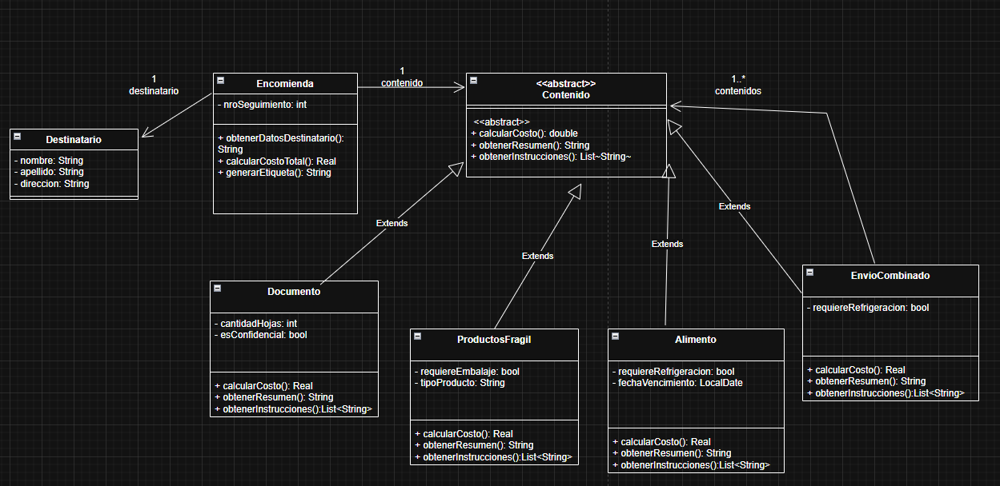
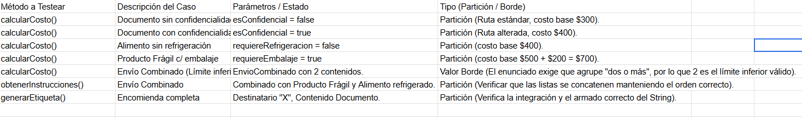

# A.

1. 

2. 
import java.time.LocalDate;
import java.util.ArrayList;
import java.util.List;

// --- CLASES BASE ---
public class Destinatario {
    private String nombre;
    private String direccion;

    public Destinatario(String nombre, String direccion) {
        this.nombre = nombre;
        this.direccion = direccion;
    }

    public String getInformacion() {
        return "Destinatario: " + this.nombre + " - Dirección: " + this.direccion;
    }
}

public abstract class Contenido {
    public abstract double calcularCosto();
    public abstract String obtenerResumen();
    public abstract List<String> obtenerInstrucciones();
}

// --- TIPOS DE CONTENIDO ---
public class Documento extends Contenido {
    private int cantidadHojas;
    private boolean esConfidencial;

    public Documento(int cantidadHojas, boolean esConfidencial) {
        this.cantidadHojas = cantidadHojas;
        this.esConfidencial = esConfidencial;
    }

    @Override
    public double calcularCosto() {
        return 300 + (this.esConfidencial ? 100 : 0);
    }

    @Override
    public String obtenerResumen() {
        return "Documentos (" + this.cantidadHojas + " hojas)";
    }

    @Override
    public List<String> obtenerInstrucciones() {
        List<String> inst = new ArrayList<>();
        if (this.esConfidencial) inst.add("Manejo confidencial.");
        return inst;
    }
}

public class ProductoFragil extends Contenido {
    private String tipoProducto;
    private boolean requiereEmbalaje;

    public ProductoFragil(String tipoProducto, boolean requiereEmbalaje) {
        this.tipoProducto = tipoProducto;
        this.requiereEmbalaje = requiereEmbalaje;
    }

    @Override
    public double calcularCosto() {
        return 500 + (this.requiereEmbalaje ? 200 : 0);
    }

    @Override
    public String obtenerResumen() {
        return "Producto Frágil: " + this.tipoProducto;
    }

    @Override
    public List<String> obtenerInstrucciones() {
        List<String> inst = new ArrayList<>();
        inst.add("Tratar con cuidado (Frágil).");
        if (this.requiereEmbalaje) inst.add("Requiere embalaje especial.");
        return inst;
    }
}

public class Alimento extends Contenido {
    private LocalDate fechaVencimiento;
    private boolean requiereRefrigeracion;

    public Alimento(LocalDate fechaVencimiento, boolean requiereRefrigeracion) {
        this.fechaVencimiento = fechaVencimiento;
        this.requiereRefrigeracion = requiereRefrigeracion;
    }

    @Override
    public double calcularCosto() {
        return 400 + (this.requiereRefrigeracion ? 150 : 0);
    }

    @Override
    public String obtenerResumen() {
        return "Alimentos (Vence: " + this.fechaVencimiento.toString() + ")";
    }

    @Override
    public List<String> obtenerInstrucciones() {
        List<String> inst = new ArrayList<>();
        if (this.requiereRefrigeracion) inst.add("Mantener refrigerado.");
        return inst;
    }
}

public class EnvioCombinado extends Contenido {
    private List<Contenido> contenidos;

    public EnvioCombinado() {
        this.contenidos = new ArrayList<>();
    }

    public void agregarContenido(Contenido c) {
        this.contenidos.add(c);
    }

    @Override
    public double calcularCosto() {
        return this.contenidos.stream().mapToDouble(Contenido::calcularCosto).sum();
    }

    @Override
    public String obtenerResumen() {
        List<String> resumenes = new ArrayList<>();
        for (Contenido c : this.contenidos) {
            resumenes.add(c.obtenerResumen());
        }
        return String.join("; ", resumenes);
    }

    @Override
    public List<String> obtenerInstrucciones() {
        List<String> todasLasInstrucciones = new ArrayList<>();
        for (Contenido c : this.contenidos) {
            todasLasInstrucciones.addAll(c.obtenerInstrucciones());
        }
        return todasLasInstrucciones;
    }
}

// --- LA ENCOMIENDA ---
public class Encomienda {
    private int nroSeguimiento;
    private Destinatario destinatario;
    private Contenido contenido;

    public Encomienda(int nroSeguimiento, Destinatario destinatario, Contenido contenido) {
        this.nroSeguimiento = nroSeguimiento;
        this.destinatario = destinatario;
        this.contenido = contenido;
    }

    public double costoTotal() {
        return this.contenido.calcularCosto();
    }

    public String generarEtiqueta() {
        StringBuilder sb = new StringBuilder();
        sb.append("--- ETIQUETA DE ENVÍO ---\n");
        sb.append("Seguimiento: ").append(this.nroSeguimiento).append("\n");
        sb.append(this.destinatario.getInformacion()).append("\n");
        sb.append("Resumen: ").append(this.contenido.obtenerResumen()).append("\n");
        sb.append("Instrucciones: \n");
        
        int i = 1;
        for (String inst : this.contenido.obtenerInstrucciones()) {
            sb.append(i++).append(". ").append(inst).append("\n");
        }
        sb.append("Costo Total: $").append(this.costoTotal()).append("\n");
        return sb.toString();
    }
}

3. 

# B. Responder (Teoría)
1. Atributos públicos en CuentaBancaria. ¿Es una solución apropiada?
No, es una solución completamente inapropiada porque rompe el principio de Encapsulamiento. En la orientación a objetos, las variables de instancia deben ser siempre privadas (private). Exponer el saldo como public permite que cualquier otra clase modifique ese valor libremente sin pasar por los métodos depositar() o extraer(), perdiendo todo el control sobre el estado del objeto y pudiendo dejar a la cuenta con un saldo inconsistente (ej. negativo sin autorización).  
2. Método calcularTotal() de Factura accediendo directamente a los atributos de Item. ¿Es apropiado?
No, es inapropiado porque viola la heurística del Experto en Información y genera el "mal olor" conocido como Envidia de Atributos (Feature Envy). La clase Factura le está pidiendo los datos al Item para hacer el cálculo matemátco por fuera. La responsabilidad de calcular el subtotal debe asignarse a la clase que tiene la información necesaria para hacerlo, que en este caso es el Item. La Factura debería simplemente iterar enviando el mensaje calcularSubtotal() a cada Item y sumar los resultados. 